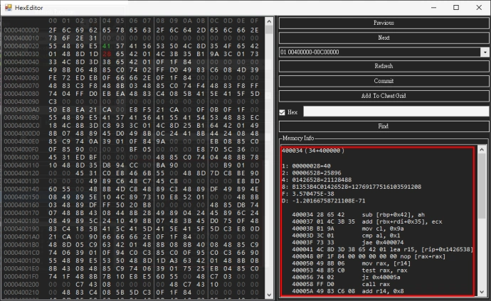
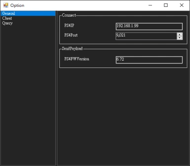

# Overview

PS4CheaterNeo is a program to find game cheat codes, and it is based on [`ps4debug`](https://github.com/jogolden/ps4debug) and `.Net Framework 4.8`.

Currently in `version 0.9.5.1-beta`

## Table of Contents
- [Building](#building)
- [Description](#description)
  * [SendPayload](#sendpayload)
  * [ps4debug](#ps4debug)
  * [Cheat window](#cheat-window)
  * [Add Address](#add-address)
  * [Query window](#query-window)
  * [Section](#section)
  * [Group ScanType](#group-scantype)
  * [Group ScanType unspecified types](#group-scantype-unspecified-types)
  * [Hex Editor](#hex-editor)
  * [Pointer finder](#pointer-finder)
  * [Option](#option)
- [Reference](#reference)

[TOC generated by markdown-toc](https://ecotrust-canada.github.io/markdown-toc/)

## Building

- Open `PS4CheaterNeo.sln` with Visual Studio([Community](https://visualstudio.microsoft.com/vs/community/) also available) and built with .Net Framework 4.8.

## Description

- User interface re-layout and design to `dark mode`.
- The `cheat` window and the `query` window are separated.
- `Hex Editor` can be opened from the `cheat` or `query` window.
- `Pointer finder` can be executed from the `cheat` or `query` lists.

### SendPayload

- Opening the `PS4CheaterNeo` program will automatically detect whether `ps4debug` is enabled.
- If not enabled, `SendPayload` will be executed to enable `ps4debug`.
- You must specify the ps4 connection `IP` in SendPayload.
- `SendPayload` requires the `ps4debug.bin` file that conforms to the `FW` version.
- Port is `9090` when using `GoldHEN2.0b` to `Enable BinLoader Server`, Other `Bin Loader` tool port is usually `9021`.

### ps4debug

- You must manually copy `ps4debug.bin` to the `same path as PS4CheaterNeo.exe`\payloads\\[`FW version`]\ directory.

> path\PS4CheaterNeo\bin\Debug\payloads\\[FW version]\ps4debug.bin  
> path\PS4CheaterNeo\bin\Release\payloads\\[FW version]\ps4debug.bin  

- It can be downloaded at the following URL(`Only ps4debug 6.72 has been tested`).

> [ps4debug 5.05](https://github.com/jogolden/ps4debug/releases)  
> [ps4debug 6.72](https://github.com/GiantPluto/ps4debug/releases)  
> [ps4debug 7.02](https://github.com/ChendoChap/ps4debug/tags)  
> [ps4debug 7.55](https://github.com/Joonie86/ps4debug/releases)  
> [ps4debug 9.00](https://www.reddit.com/r/ps4homebrew/comments/rimeyi/900fw_ported_ps4debug_and_webrte_payloads/)  

### Cheat window

- The cheat list can be loaded with cheats file, and the cheat value can be `edited` and `locked`.
- The cheat list has a group expandable/collapsable mechanism, and the cheat description with the same beginning will be set to the same group.
- You can add the address to the `Cheat List` from the `Query window` or `Hex Editor`, and can also be added manually.

### Add Address

- You can manually add addresses to the `Cheat List`.

### Query window

- Opening the query window will automatically refresh processes list, if eboot.bin already exists it will be selected.
- Support query multiple targets, Multiple query windows can be opened at the same time.
- In addition to query types such as `Byte, Float, Double, Hex`, etc., it also supports `Group` types.
- Make the `section` of the suspected target more obvious.
- The query value will skip the filtered `section` list when the filter checkbox is clicked.
- The preset `section` filter rules is `libSce, libc.prx, SceShell, SceLib, SceNp, SceVoice, SceFios, libkernel, SceVdec`, these rules can also be customized.

### Section

- The memory address of the PS4 game is the start position of the specific `section` plus the relative offset value.
- The start position of `sections` is `dynamic` and will change every time you start the game or load the game save or just go through a scene in the game.
- This program will reload the `sections` when executes the `lock` or `refresh` the cheat codes to ensure that it is correct.

### Group ScanType

- Use `group search` when you already know the `data structure` of the query target.
- Input format: [`ValueType`1:]`ValueNumber`1 [,] [`ValueType`2:]`ValueNumber`2 [,] [`ValueType`3:]`ValueNumber`3...
- The `ValueType` can be `1`(Byte), `2`(2 Bytes), `4`(4 Bytes), `8`(8 Bytes), `F`(Float), `D`(Double), `H`(Hex) or not specified.
- The `ValueNumber` can be specified as an asterisk(`*`) or question mark(`?`) when the value is unknown.
- The delimiter can be comma(`,`) or space(` `).

### Group ScanType unspecified types

- The type of literals in a group search can be automatically determined by its `suffix or prefix or specific characters` as follows(`case insensitive`):
- The literal with the `u or ul, lu suffix` is of type `ulong(8 Bytes)`,
- The literal with the `f suffix` is of type `float`,
- The literal with the `d suffix` is of type `double`,
- The literal with the `0x prefix` is of type `Hex(hexadecimal)`,
- The literal contains a `decimal point (.)` character is of type `float`,
- The literal contains `a~f characters` is of type `Hex(hexadecimal)` when not parsed as float and double,
- Other literals of `unspecified types`, default to `uint(4 Bytes)` type.

> Example:  
> Assuming the target `structure` is `63 00` `E7 03 00 00` `AB CD 00 00` `00 01`  
> `Group scan` can be entered as `2:99 999 ? 2:256`  
> Assuming the target `structure` is `02 00` `AB CD` `E7 03 00 00` `01 00 00 00 00 00 00 00`
> `Group scan` can be entered as `2:2` `2:?` `e7030000` `1u`

### Hex Editor

- Display the detailed information values of the address value of the current cursor position.
- Make address values greater than zero more obvious.
- You can add the address to the `Cheat List` from the current cursor position.

### Pointer finder

- Make the `base address` of the pointer be in the `executable section` when `FastScan` is clicked.
- If there is no result, you can try to click `NegativeOffset`.
- The finder will skip the filtered section list when the `filter` checkbox is clicked.
- The preset section filter rules is `libSce, libc.prx, SceShell, SceLib, SceNp, SceVoice, SceFios, libkernel, SceVdec`, these rules can also be customized.

### Option

- Added option window, you can adjust some program settings.

- General

> `PS4IP`: Enter PS4 IP location.  
> `PS4Port`: Enter PS4 Port.  
> `PS4FWVersion`: Enter PS4 FW Version (Confirm the fw version only when perform sendpayload).  

- Cheat

> `VerifySectionWhenLock`: Determine whether to enable verifying Section values when locking cheat items, `Default enabled`.  
> `VerifySectionWhenRefresh`: Determine whether to enable verifying Section values when refreshing the cheat list, `Default enabled`.  

- Query

> `AutoPerformGetProcesses`: Determine whether to enable automatic perform get processes when opening the Query window, `Default enabled`.  
> `DefaultProcess`: Set the default selected program when perform get processes, `Default is eboot.bin`.  
> `MaxQueryThreads`: Enter the number of threads to use when querying, `Default is 3 threads`.  
> `MinResultAccessFactor`: Access value directly by address when the number of query results for the same Section is less than this factor, Used to control whether to read Section data completely, or directly access the value by address, `Default value is 50`.  
> `EnableFilterQuery`: Determine whether to enable filtering Sections when opening the query window, `Default enabled`.  
> `SectionFilterKeys`: Enter the filter value, the filter will be set here when listing Sections.  
> `MaxResultShow`: Enter the maximum number of displayed query results. will only affect the number of results displayed in the ResultView, `Default value is 8192`.  
> `QueryBufferSize`: Set the minimum buffer size (in MB) in querying and pointerFinder, enter 0 to not use buffer, Setting this value to 0 is better when the total number of Sections in the game is low. If the game has more than a thousand Sections, Buffer must be set.  

## Reference

[ps4debug](https://github.com/jogolden/ps4debug)  
[PS4_Cheater](https://github.com/hurrican6/PS4_Cheater)  
[Be.HexEditor](https://github.com/Pkcs11Admin/Be.HexEditor)  
[GroupGridView](https://github.com/avan06/GroupGridView)  