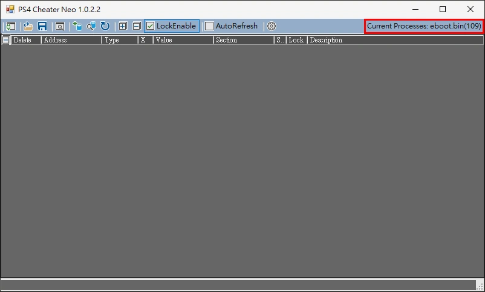
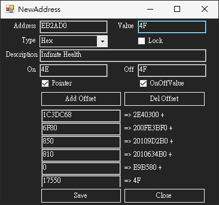
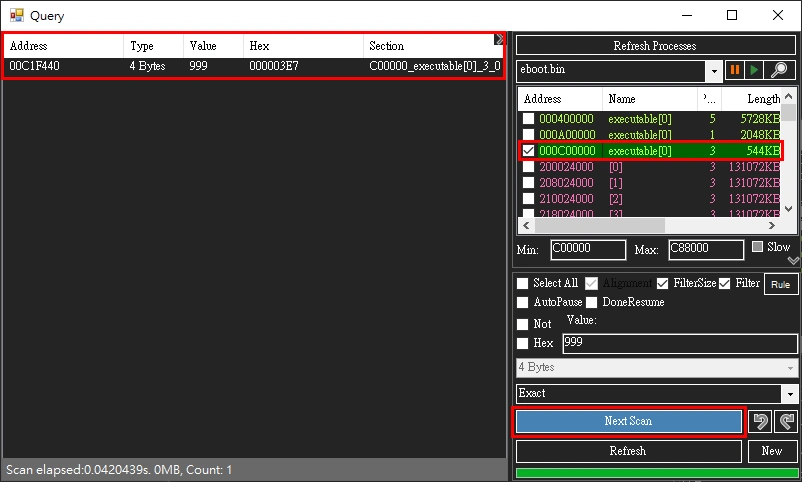
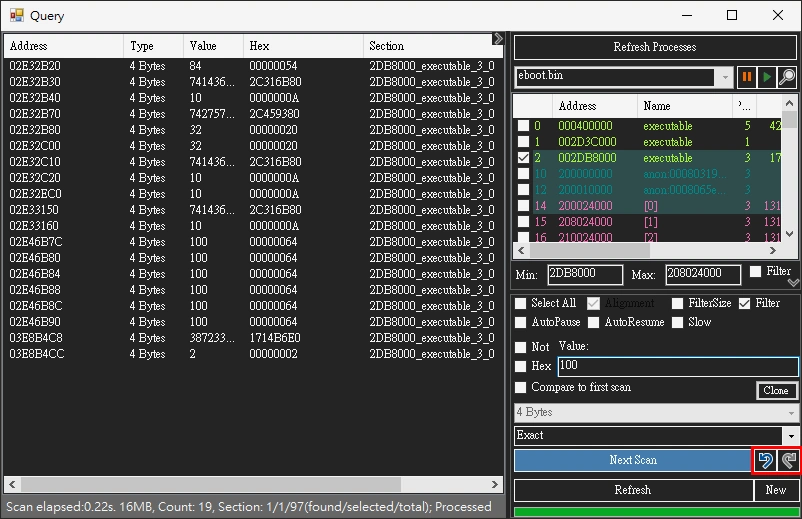
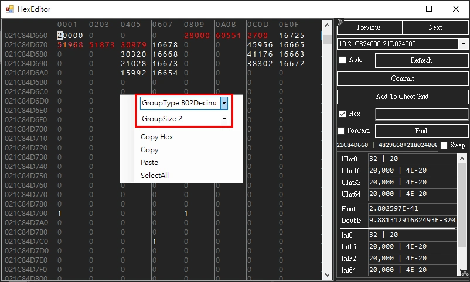
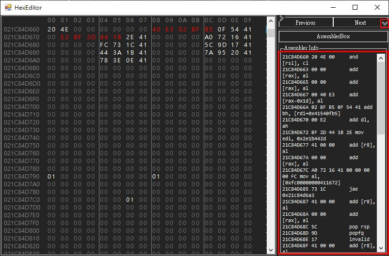

# Overview

PS4CheaterNeo is a program to find game cheat codes, and it is based on [`ps4debug`](https://github.com/jogolden/ps4debug) and `.Net Framework 4.8`.

Currently in `version 0.9.7.10-beta`


## Table of Contents
- [Building](#building)
- [Description](#description)
  * [SendPayload](#sendpayload)
  * [ps4debug](#ps4debug)
  * [Cheat window](#cheat-window)
  * [Cheat file support](#cheat-file-support)
  * [Add Address](#add-address)
  * [Query window](#query-window)
  * [Experimental feature](#experimental-feature)
  * [Section](#section)
  * [Section ID](#section-id)
  * [Group ScanType](#group-scantype)
  * [Group ScanType unspecified types](#group-scantype-unspecified-types)
  * [Hex Editor](#hex-editor)
  * [Pointer finder](#pointer-finder)
  * [Option](#option)
- [Reference](#reference)

[TOC generated by markdown-toc](https://ecotrust-canada.github.io/markdown-toc/)


## Building

- Open `PS4CheaterNeo.sln` with Visual Studio([Community](https://visualstudio.microsoft.com/vs/community/) also available) and built with .Net Framework 4.8.


## Description

- User interface re-layout and design to `dark mode`.
- Added support for `light theme` now.
- The `cheat` window and the `query` window are separated.
- `Hex Editor` can be opened from the `cheat` or `query` window.
- `Pointer finder` can be executed from the `cheat` or `query` lists.


### SendPayload

- Opening the `PS4CheaterNeo` program will automatically detect whether `ps4debug` is enabled.
- If not enabled, `SendPayload` will be executed to enable `ps4debug`.
- You must specify the ps4 connection `IP` in SendPayload.
- `SendPayload` requires the `ps4debug.bin` file that conforms to the `FW` version.
- Port is `9090` when using `GoldHEN2.x` to `Enable BinLoader Server`, Other `Bin Loader` tool port is usually `9021`.


### ps4debug

- You must manually copy `ps4debug.bin` to the `same path as PS4CheaterNeo.exe`\payloads\\[`FW version`]\ directory.

> ex.  
> path\PS4CheaterNeo\bin\Debug\payloads\\[FW version]\ps4debug.bin  
> path\PS4CheaterNeo\bin\Release\payloads\\[FW version]\ps4debug.bin  

- It can be downloaded at the following URL(`Only ps4debug 6.72 has been tested`).

> [ps4debug 5.05 by jogolden](https://github.com/jogolden/ps4debug/releases)  
> [ps4debug 6.72 by GiantPluto](https://github.com/GiantPluto/ps4debug/releases)  
> [ps4debug 7.02 by ChendoChap](https://github.com/ChendoChap/ps4debug/tags)  
> [ps4debug 7.55 by Joonie86](https://github.com/Joonie86/ps4debug/releases)  
> [ps4debug 9.00 by Karo](https://twitter.com/i/web/status/1471590847707856905)  
> [ps4debug all firmware (5.0X, 6.72, 7.02, 7.5X, 9.00) by ctn123](https://github.com/ctn123/PS4_Cheater/releases/)

### Cheat window

- The cheat list can be loaded with cheats file, and the cheat value can be `edited` and `locked`.
- The cheat list has a `group expandable/collapsable` mechanism, and the `cheat description with the same beginning` will be set to the same group.
- The cheat list will show row number.
- Support using `keyboard up, down or mouse wheel` to adjust value when modifying cheat Value.
- You can add the address to the `Cheat List` from the `Query window` or `Hex Editor`, and can also be added manually.
- You can copy the memory address from the cheat or query list.
- You can also open the `Hex editor` in the main window and manually enter the address.
- The value of `multiple addresses` can be edited at the same time, select the multiple cheats and right-click to perform the edit.





### Cheat file support

- Cheat (*.cht)  
PS4CheaterNeo special format, but also supports loading(only) the following formats:
> 1.5|eboot.bin|ID:CUSA99999|VER:09.99|FM:672  
> `data`|2|ABCDE|4 bytes|999|0|DescForData|30ABCDE  
> `simple pointer`|pointer|float|@7777777_3_3333333+50+0+8+1B0+64|data|float|999|1|DescForPointer|  
> `@batchcode`|data|0|0|code||offset:0x7777777 value:0x0123456789ABCDEF size:8;offset:0xAABBCC value:0x0123456789 size:5|0|DescForBatchcode  

- Cheat Relative (*.chtr)  
PS4CheaterNeo special format, use relative addresses when multiple cheat addresses are close together  

- Cheat Json (*.json)  
Cheat format used by PS4 Trainer and GoldHEN Cheat  

### Add Address

- You can manually add addresses to the `Cheat List`.




### Query window

- Opening the query window will automatically refresh processes list, if eboot.bin already exists it will be selected.
- Support query multiple targets, Multiple query windows can be opened at the same time.
- In addition to query types such as `Byte, Float, Double, Hex`, etc., it also supports `Group` types.
- Make the `section` of the suspected target more obvious.
- The `section` list whose length is less than `SectionFilterSize` (default is 200K, can be modified in Option) will be filtered when the `FilterSize` checkbox is clicked.
- The query value will skip the filtered `section` list when the `Filter` checkbox is clicked.
- The preset `section` filter rules is `libSce, libc.prx, SceShell, SceLib, SceNp, SceVoice, SceFios, libkernel, SceVdec`, these rules can also be customized.
- Support dump `section` to binary files in `section` list.





### Experimental feature


#### Query window: SlowMotion and Pause

- It's an `experimental feature` requires `Attach ps4 Debugging`, after Attach ps4 Debugging,
- Be sure to `close query window before closing the game`, otherwise the PS4 will `crash`.
- Be sure to `close query window before closing the game`, otherwise the PS4 will `crash`.
- Be sure to `close query window before closing the game`, otherwise the PS4 will `crash`.
- 
- Performing `SlowMotion` will require Enter the `SlowMotion interval` (in `milliseconds`, larger intervals will be slower)


#### Query window: undo scan

- Support undo scan(revert to the previous scan result), need to enable `EnableUndoScan` in the options.
- Support automatically pause the game when starting the scan in query, need to enable `EnableScanAutoPause` in the options.
- Support automatically resume the game when the scan is complete in query, need to enable `EnableScanDoneResume` in the options.




#### Hex editor: show changed

- Immediately show the changed position when `refreshing in the Hex editor`.
- Support `auto refresh interval` when `Auto is enabled` in the `Hex editor`.(recommended for wired network, the current setting is every 2.5 seconds)


#### Hex editor: displaying decimal, float, and double

- The hex value can be displayed as a numeric value, when the ByteGrouping of Hex editor is set to decimal or float or double.
- Note: This feature is for display only and does not support direct editing of values.
- ByteGrouping types are as follows:
- B01 = Size:01, Hex
- B02 = Size:02, Hex
- B04 = Size:04, Hex
- B08 = Size:08, Hex
- B16 = Size:16, Hex
- B01Decimal = Size:01, Decimal byte
- B02Decimal = Size:02, Decimal ushort
- B04Decimal = Size:04, Decimal uint
- B08Decimal = Size:08, Decimal ulong
- B04Float = Size:04, Float
- B08Double  = Size:08, Double




#### Query window: format of range value supports offset

- An offset can be used to enter the scan range in the Query window.
- Range format (hex, "0x" can be omitted):
- Min: 12345678-1000 Max: 12345678+1000
- Min: 0x12345678-0x1000 Max: 0x12345678+0x1000


#### Query window: collapsible split container ui and added SimpleValue, Not, AutoPause and DoneResume CheckBox 

- Added collapsible split container ui in Query and HexEditor and PointerFinder (can be set in options to enable or not).
- Added SimpleValue CheckBox in the query window. When the scan type is float or double, this feature can be enabled to reduce unnecessary results.
- Added Not CheckBox in the query window. When this feature is enabled, the scanning logic can be reversed. For example, if the compare type is exact and Not is enabled, it becomes not exact.
- Added AutoPause and DoneResume CheckBox in the query window, you can determine whether to enable or not.


#### Query window: search hex with wildcards or decimal

- Added support for search hex with wildcards when ScanType is Hex  
> For example  
> Memory: 00 00 00 10 FF EE DD CC 00 00 00 20  
> Input: 00 00 00 10 `??` `??` `**` `**` 00 00 00 20  
> Hex CheckBox `clicked`, ?? is the same as **, `blank` can also be `omitted`  

- Added support for search hex using decimal when ScanType is Hex  
> For example  
> Memory: 00 00 00 10 FF EE DD CC 00 00 00 20  
> Input: `?` `?` `?` `?` 255 238 221 204 `*` `*` `*` `*`  
> Hex CheckBox `unclicked`, ? is the same as *, `blank` spaces are `required`  


### Section

- The memory address of the PS4 game is the start position of the specific `section` plus the relative offset value.
- The start position of `sections` is `dynamic` and will change every time you start the game or load the game save or just go through a scene in the game.
- This program will reload the `sections` when executes the `lock` or `refresh` the cheat codes to ensure that it is correct.


### Section ID

- To process memory addresses, the program needs to use `SectionID` to obtain the corresponding Section.  
The original PS4_Cheater's rule for establishing SectionID is to sort Sections from low to high address, and obtain the count value as SectionsID.  
for example, if the SectionID is 100, the Section in the 100th position will be read.  
What is the problem? When the number of Sections is low, the order will not be wrong,  
but if the number of Sections is from one hundred to more than one thousand, it is easy to obtain the wrong Section,  
because the game is started at different times, the value of Section often changes.  

- This program attempts to create a SectionID that can correctly correspond to a Section at different times,  
- SectionID is abbreviated as SID below, and its encoding rules are as follows(rules established `before 0.9.5.5-beta`):  
1. The `1st` code is idx used to count multiple Sections generated by the same MemoryEntry
2. The `3rd to 6th` code is sIdx will continue to count until the Prot value changes and will be reset
3. The `7th to 8th` code is ProtCnt will count when the Prot value changes
4. The `9th` code is the TypeCode when the Section has a name it is 1, otherwise it is 2

- After a while, I found that the above rules are still not enough, and the new encoding rules `from 0.9.5.5-beta` are as follows:  
1. The `1st` code is idx used to count multiple Sections generated by the same MemoryEntry
2. The `3rd to 5th` code is sIdx will continue to count until the HighBits or TypeCode or Prot changes, it will be reset
3. The `6th` code is ProtCnt which counts when the Prot value changes and resets when the TypeCode changes
4. The `7th` code is the TypeCode when the Section has a name it is 1, otherwise it is 2
5. The `8th to 10th` code is HighBits which will be taken from the high-order bits of the address, such as AB12345678 => 171(AB)

- Saving will automatically update the SID value when loading cht cheat files from older versions.

- For example:

1. If the destination address we found is `3890012345`, its Section is `3890000000`, and the relative address is `12345`  
The current Section table is as follows:  

```
AddrStart　　Prot　count　　　SIDv1　　　　　SID
34E6200000　　3　　1076　　200006300　　522000600
34E7800000　　3　　1077　　200006400　　522000700
3890000000　　3　　1078　　200006500　　562000000 <-- Section of the destination address
3890200000　　3　　1079　　200006600　　562000100
3890600000　　3　　1080　　200006700　　562000200
```

2. Each Section does not exist every time, causing the total number of Sections to increase or decrease,  
suppose the next time you start the game, `add Section 34EA200000`, and its SID will change to the following  
use the "`count or SIDv1`" of the previous save and you will get the wrong Section  

```
AddrStart　　Prot　count　　　SIDv1　　　　　SID
34E6200000　　3　　1076　　200006300　　522000600
34E7800000　　3　　1077　　200006400　　522000700
34EA200000　　3　　1078　　200006500　　522000800 <-- Suppose this Section is added when the game is started this time, using count or SIDv1 will get the wrong Section
3890000000　　3　　1079　　200006600　　562000000 <-- The actual Section of the destination address
3890200000　　3　　1080　　200006700　　562000100
3890600000　　3　　1081　　200006800　　562000200
```

### Group ScanType

- Use `group search` when you already know the `data structure` of the query target.
- Input format: [`ValueType`1:]`ValueNumber`1 [,] [`ValueType`2:]`ValueNumber`2 [,] [`ValueType`3:]`ValueNumber`3...
- The `ValueType` can be `1`(Byte), `2`(2 Bytes), `4`(4 Bytes), `8`(8 Bytes), `F`(Float), `D`(Double), `H`(Hex) or not specified.
- The `ValueNumber` can be specified as an asterisk(`*`) or question mark(`?`) when the value is unknown.
- The delimiter can be comma(`,`) or space(` `).


### Group ScanType unspecified types

- The type of literals in a group search can be automatically determined by its `suffix or prefix or specific characters` as follows(`case insensitive`):
- The literal with the `u or ul, lu suffix` is of type `ulong(8 Bytes)`,
- The literal with the `f suffix` is of type `float`,
- The literal with the `d suffix` is of type `double`,
- The literal with the `0x prefix` is of type `Hex(hexadecimal)`,
- The literal contains a `decimal point (.)` character is of type `float`,
- The literal contains `a~f characters` is of type `Hex(hexadecimal)` when not parsed as float and double,
- Other literals of `unspecified types`, default to `uint(4 Bytes)` type.

> Example:  
> Assuming the target `structure` is `63 00` `E7 03 00 00` `AB CD 00 00` `00 01`  
> `Group scan` can be entered as `2:99 999 ? 2:256`  
> Assuming the target `structure` is `02 00` `AB CD` `E7 03 00 00` `01 00 00 00 00 00 00 00`  
> `Group scan` can be entered as `2:2` `2:?` `e7030000` `1u`  


### Hex Editor

- Display the detailed information values of the address value of the current cursor position.
- Make address values greater than zero more obvious.
- You can add the address to the `Cheat List` from the current cursor position.
- The current scroll position will not be changed when refreshing the Hex editor.
- Turns `red` when an address value is modified, and `green` after committing.
- Ability to `copy and paste` hex values.
- `Disassembler` current hex values and display.
- Enter `assembler` and display as hex value.
- Immediately show the changed position when `refreshing in the Hex editor`.
- Support `auto refresh interval` when `Auto is enabled` in the `Hex editor`.(recommended for wired network, the current setting is every 2.5 seconds)
- It is now possible to `swap bytes` to display the value of the current address in the Hex Editor.
- Added support for find backward or forward feature in Hex editor, Default is find backward.





### Pointer finder

- Make the `base address` of the pointer be in the `executable section` when `FastScan` is clicked.
- If there is no result, you can try to click `NegativeOffset`.
- The finder will skip the filtered section list when the `filter` checkbox is clicked.
- The preset section filter rules is `libSce, libc.prx, SceShell, SceLib, SceNp, SceVoice, SceFios, libkernel, SceVdec`, these rules can also be customized.
- Default maximum offset range (MaxRange) changed from 8192 to 0 (unlimited range) in PointerFinder.


### Option

- Added option window, you can adjust some program settings.

#### General  
- `PS4IP`:  
Enter PS4 IP location.  
- `PS4Port`:  
Enter PS4 Port.  
- `PS4FWVersion`:  
Enter PS4 FW Version (Confirm the fw version only when perform sendpayload).  
- `EnableCollapsibleContainer`:  
Determines whether to enable `collapsible split container` ui in `Query and HexEditor and PointerFinder` windows. Default enabled.  
- `UIOpacity`:
Determines the opacity of the window, the maximum is 1 (opaque), `Default is 0.95`.  

#### Cheat  
- `EnableCheatLock`:  
Determines whether to `enable cheat lock` in the `main` window. `Default enabled`.  
- `CheatCellDirtyValueCommit`:  
Determine whether to automatically write to PS4 when editing cheat values in UpDown, `Default enabled`.  
- `VerifySectionWhenLock`:  
Determine whether to enable verifying Section values when locking cheat items, `Default enabled`.  
- `VerifySectionWhenRefresh`:  
Determine whether to enable verifying Section values when refreshing the cheat list, `Default enabled`.  

#### Query  
- `AutoPerformGetProcesses`:  
Determine whether to enable automatic perform get processes when opening the Query window, `Default enabled`.  
- `DefaultProcess`:  
Set the default selected program when perform get processes, `Default is eboot.bin`.  
- `MaxQueryThreads`:  
Enter the number of threads to use when querying, `Default is 3 threads`.  
- `MinResultAccessFactor`:  
Access value directly by address when the number of query results for the same Section is less than this factor, Used to control whether to read Section data completely, or directly access the value by address, `Default value is 50`.  
- `EnableFilterQuery`:  
Determine whether to enable filtering Sections when opening the query window, `Default enabled`.  
- `SectionFilterKeys`:  
Enter the filter value, the filter will be set here when listing Sections.  
- `EnableFilterSizeQuery`:  
Determine whether to enable filtering Sections when opening the query window. `Default enabled`.
- `SectionFilterSize`:  
Filter out when section size is less than this value(unit is bytes), `Default is 204,800`.  
- `MaxResultShow`:  
Enter the maximum number of displayed query results. will only affect the number of results displayed in the ResultView, `Default value is 8192`.  
- `QueryBufferSize`:  
Set the minimum buffer size (in MB) in querying and pointerFinder, enter 0 to not use buffer, Setting this value to 0 is better when the total number of Sections in the game is low. If the game has more than a thousand Sections, Buffer must be set.  
- `EnableUndoScan`:  
Determines whether to enable undo scan(revert to the previous scan result), if enabled, more memory needs to be used during scanning. `Default enable`.  
- `EnableScanAutoPause`:  
Determines whether to automatically pause the game when starting the scan in query. `Default disabled`.  
- `EnableScanDoneResume`:  
Determines whether to automatically resume the game when the scan is complete in query. `Default disabled`.  
- `EnableShowSearchSizeFirstScan`:  
Determines whether to show search size message when FirstScan. `Default enabled`.  
- `EnableFloatingResultExact`:  
Determines whether to make the calculation result of `Floating(float, double) completely exact` in query window, there can be `0.0001 difference` in the old mechanism. `Default enabled`.  
- `FloatingSimpleValueExponents`:  
Determine the `exponents value of the simple value of floating`. this option value is used in the query window when SimpleValues for floating point numbers is enabled. Cheat Engine is set to 11 (2 to the 11th power = 2^11 = plus or minus 2048). `Default value is 11`.  

#### HexEditor  
- `EnableAutoRefresh`:  
Determines whether to enable `Auto Refresh` in HexEditor. `Default disabled`.  
- `AutoRefreshTimerInterval`:  
Determines the Interval of AutoRefreshTimer when AutoRefresh is enabled, in `milliseconds`, HexEditor needs to be restarted after this value is changed. `Default 2500`.  
- `HexInfoDash`:  
Determines the delimited dash value that displays the current Hex value in the HexEditor. Default "-".  

#### UI  
- `ColorTheme`:  
Determine color theme.  
- `UiForeColor`:  
Determine the UI foreground color.  
- `UiBackColor`:  
Determine the UI background color.  
- `MainForeColor`:  
Determine the Main foreground color.  
- `MainBackColor`:  
Determine the Main background color.  
- `MainToolStrip1BackColor`:  
Determine the Main ToolStrip1 background color.  
- `MainCheatGridViewRowIndexForeColor`:  
Determine the Main CheatGridView RowIndex foreground color.  
- `MainCheatGridViewBackgroundColor`:  
Determine the Main CheatGridView background color.  
- `MainCheatGridViewBaseRowColor`:  
Determine the Main CheatGridView base row color.  
- `MainCheatGridViewGridColor`:  
Determine the Main CheatGridView grid color.  
- `MainCheatGridCellForeColor`:  
Determine the Main dataGridViewCellStyle foreground color.  
- `MainCheatGridCellBackColor`:  
Determine the Main dataGridViewCellStyle background color.  
- `QueryStatusStrip1BackColor`:  
Determine the Query StatusStrip1 background color.  
- `QueryAlignmentBoxForeColor`:  
Determine the AlignmentBox foreground color.  
- `QueryScanBtnBackColor`:  
Determine the Query ScanBtn background color.  
- `QuerySectionViewFilterForeColor`:  
Determine the Query SectionView Filter foreground color.  
- `QuerySectionViewFilterBackColor`:  
Determine the Query SectionView Filter background color.  
- `QuerySectionViewFilterSizeForeColor`:  
Determine the Query SectionView FilterSize foreground color.  
- `QuerySectionViewFilterSizeBackColor`:  
Determine the Query SectionView FilterSize background color.  
- `QuerySectionViewExecutableForeColor`:  
Determine the Query SectionView executable foreground color.  
- `QuerySectionViewNoNameForeColor`:  
Determine the Query SectionView NoName foreground color.  
- `QuerySectionViewNoName2ForeColor`:  
Determine the Query SectionView NoName2 foreground color.  
- `QuerySectionViewItemCheck1BackColor`:  
Determine the Query SectionView ItemCheck1 background color.  
- `QuerySectionViewItemCheck2BackColor`:  
Determine the Query SectionView ItemCheck2 background color.  
- `HexEditorChangedFinishForeColor`:  
Determine the HexEditor ChangedFinish foreground color.  
- `HexEditorShadowSelectionColor`:  
Determine the HexEditor ShadowSelection color.  
- `HexEditorZeroBytesForeColor`:  
Determine the HexEditor ZeroBytes foreground color.  
- `PointerFinderStatusStrip1BackColor`:  
Determine the PointerFinder statusStrip1 background color.  
- `PointerFinderScanBtnBackColor`:  
Determine the PointerFinder ScanBtn background color.  
- `SendPayloadStatusStrip1BackColor`:  
Determine the SendPayload statusStrip1 background color.  

#### ExoprtImport  
- `Export`:  
Export now.  
- `Import`:  
Import now.  
- `Restore`:  
Restore default.  


## Reference

[ps4debug](https://github.com/jogolden/ps4debug)  
[PS4_Cheater](https://github.com/hurrican6/PS4_Cheater)  
[PS4_Cheater_ctn123](https://github.com/ctn123/PS4_Cheater)  
[Be.HexEditor](https://github.com/Pkcs11Admin/Be.HexEditor)  
[SharpDisasm](https://github.com/justinstenning/SharpDisasm)  
[AsmJit](https://github.com/hypeartist/AsmJit)  
[GroupGridView](https://github.com/avan06/GroupGridView)  
[OptionTreeView](https://github.com/avan06/OptionTreeView)  
[CollapsibleSplitcontainer](https://github.com/avan06/CollapsibleSplitcontainer)  