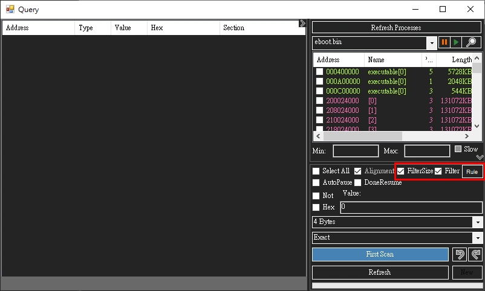
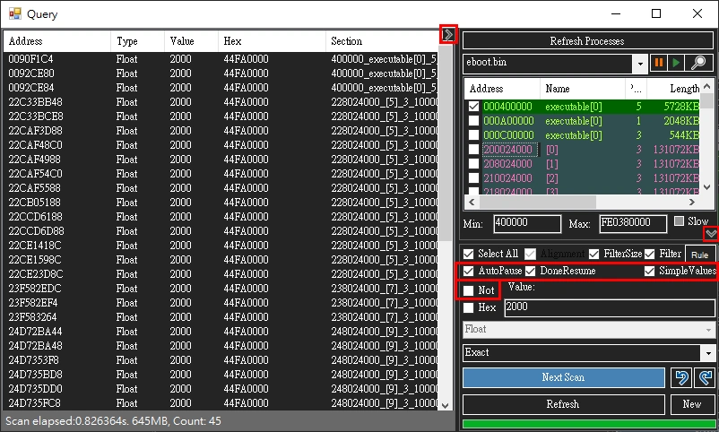
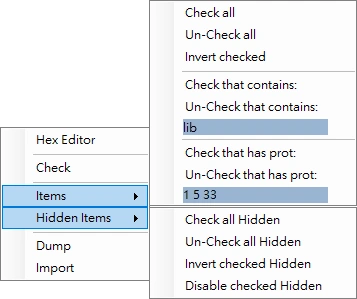
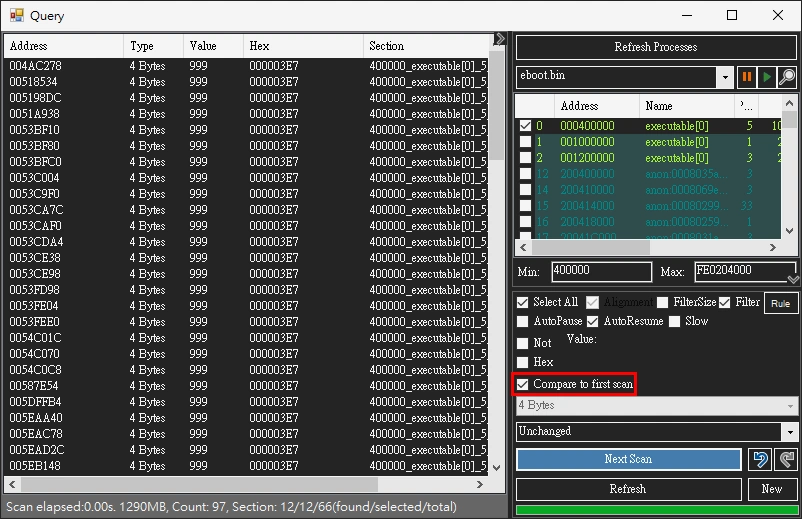
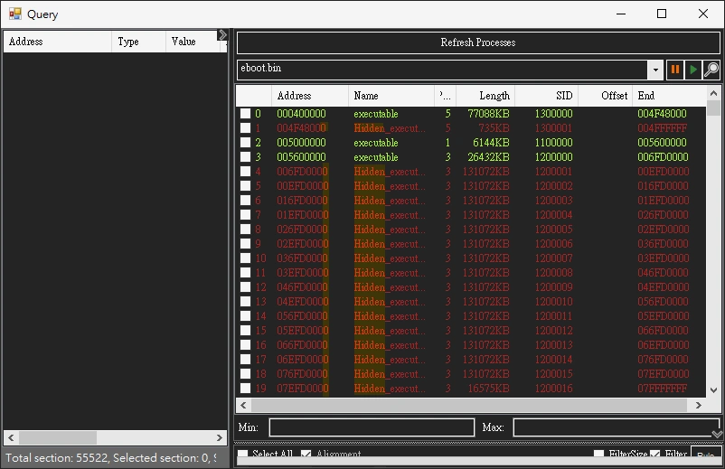
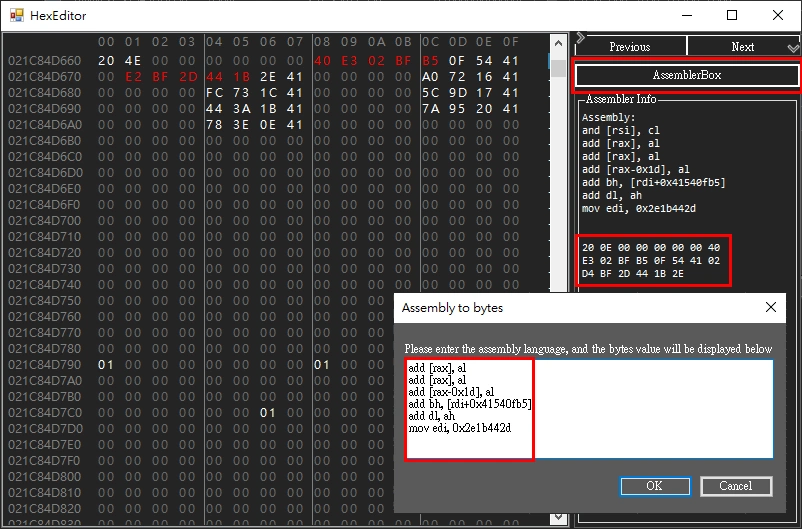

# Overview

PS4CheaterNeo is a program to find game cheat codes, and it is based on [`ps4debug`](https://github.com/jogolden/ps4debug) and [`.Net Framework 4.8`](https://support.microsoft.com/en-us/topic/microsoft-net-framework-4-8-offline-installer-for-windows-9d23f658-3b97-68ab-d013-aa3c3e7495e0).

Currently in `version 0.9.9.8-beta`


## Table of Contents
  * [Building](#building)
  * [Description](#description)
  * [SendPayload](#sendpayload)
    + [ps4debug](#ps4debug)
  * [Cheat window](#cheat-window)
    + [Cheat file support](#cheat-file-support)
    + [Add Address](#add-address)
  * [Query window](#query-window)
    + [Query window: SlowMotion and Pause](#query-window-slowmotion-and-pause)
    + [Query window: Undo scan and auto pause](#query-window-undo-scan-and-auto-pause)
    + [Query window: format of scan range supports offset](#query-window-format-of-scan-range-supports-offset)
    + [Query window: Dump Import PS4 section memory block](#query-window-dump-import-ps4-section-memory-block)
    + [Query window: Compare to first scan](#query-window-compare-to-first-scan)
    + [Query window: Detect Hidden Section](#query-window-detect-hidden-section)
  * [Scan Type](#scan-type)
    + [Scan Type: Byte](#scan-type-byte)
    + [Scan Type: 2 Bytes](#scan-type-2-bytes)
    + [Scan Type: 4 Bytes](#scan-type-4-bytes)
    + [Scan Type: 8 Bytes](#scan-type-8-bytes)
    + [Scan Type: Float](#scan-type-float)
    + [Scan Type: Double](#scan-type-double)
    + [Scan Type: String](#scan-type-string)
    + [Scan Type: Hex](#scan-type-hex)
    + [Scan Type: Group](#scan-type-group)
    + [ScanType: Group, unspecified types](#scantype-group-unspecified-types)
    + [ScanType: Auto determine numeric (AutoNumeric)](#scantype-auto-determine-numeric-autonumeric)
  * [Hex Editor](#hex-editor)
    + [Hex editor: displaying decimal, float, and double](#hex-editor-displaying-decimal-float-and-double)
    + [Hex editor: Section switching ComboBox](#hex-editor-section-switching-combobox)
  * [Pointer finder](#pointer-finder)
  * [Section](#section)
    + [Section ID](#section-id)
  * [Option](#option)
    + [General](#general)
    + [Cheat](#cheat)
    + [Query](#query)
    + [HexEditor](#hexeditor)
    + [UI](#ui)
    + [ExoprtImport](#exoprtimport)
  * [Reference](#reference)


## Building	[🔼](#table-of-contents)

- Open `PS4CheaterNeo.sln` with Visual Studio([Community](https://visualstudio.microsoft.com/vs/community/) also available) and built with [.Net Framework 4.8](https://support.microsoft.com/en-us/topic/microsoft-net-framework-4-8-offline-installer-for-windows-9d23f658-3b97-68ab-d013-aa3c3e7495e0).


## Description	[🔼](#table-of-contents)

- User interface re-layout and design to `dark mode`.
- Added support for `light theme` now. (0.9.7.8)
- The `cheat` window and the `query` window are separated.
- `Hex Editor` can be opened from the `cheat` or `query` window.
- `Pointer finder` can be executed from the `cheat` or `query` lists.
- Added support for attempting to re-establish the connection when PS4Tool's ConnectedCheck detects that PS4DBG is not connected. (0.9.9.1)


## SendPayload	[🔼](#table-of-contents)

- Opening the `PS4CheaterNeo` program will automatically detect whether `ps4debug` is enabled.
- If not enabled, `SendPayload` will be executed to enable `ps4debug`.
- You must specify the ps4 connection `IP` in SendPayload.
- `SendPayload` requires the `ps4debug.bin` file that conforms to the `FW` version.
- Port is `9090` when using `GoldHEN2.x` to `Enable BinLoader Server`, Other `Bin Loader` tool port is usually `9021`.


### ps4debug

- You must manually copy `ps4debug.bin` to the `same path as PS4CheaterNeo.exe`\payloads\\[`FW version`]\ directory.

> ex.  
> path to PS4CheaterNeo\payloads\\[FW version]\ps4debug.bin  
> path\PS4CheaterNeo\bin\Debug\payloads\\[FW version]\ps4debug.bin  
> path\PS4CheaterNeo\bin\Release\payloads\\[FW version]\ps4debug.bin  

- It can be downloaded at the following URL(`Only ps4debug 6.72 has been tested`).

> [ps4debug 5.05 by jogolden](https://github.com/jogolden/ps4debug/releases)  
> [ps4debug 6.72 by GiantPluto](https://github.com/GiantPluto/ps4debug/releases)  
> [ps4debug 7.02 by ChendoChap](https://github.com/ChendoChap/ps4debug/tags)  
> [ps4debug 7.55 by Joonie86](https://github.com/Joonie86/ps4debug/releases)  
> [ps4debug 9.00 by Karo](https://twitter.com/i/web/status/1471590847707856905)  
> [ps4debug all firmware (5.0X, 6.72, 7.02, 7.5X, 9.00) by ctn123](https://github.com/ctn123/PS4_Cheater/releases/)


## Cheat window	[🔼](#table-of-contents)

- The cheat list can be loaded with cheats file, and the cheat value can be `edited` and `locked`.
- The cheat list has a `group expandable/collapsable` mechanism, and the `cheat description with the same beginning` will be set to the same group.
- You can add the address to the `Cheat List` from the `Query window` or `Hex Editor`, and can also be added manually.
- The value of `multiple addresses` can be edited at the same time, select the multiple cheats and right-click to perform the edit. (0.9.3.0)
- You can copy the memory address from the cheat or query list. (0.9.3.2)
- You can also open the `Hex editor` in the main window and manually enter the address. (0.9.3.2)
- The cheat list will show row number. (0.9.4.5)
- Support using `keyboard up, down or mouse wheel` to adjust value when modifying cheat Value. (0.9.5.0)
- Editing cheat values in UpDown can be automatically written to PS4 when CheatCellDirtyValueCommit is enabled. (0.9.5.3)
- Added an "`Auto Refresh` Cheat" button in the main window. When enabled, it will automatically reload cheat values from the PS4 at intervals specified by the `CheatAutoRefreshTimerInterval` option. (0.9.9.2)
- Added support for automatically removing non-Hex characters from input Hex text. When you select HexView from the ToolStrip in the main window, this prevents the program from encountering Hex conversion errors. (0.9.9.5)
- Added the CheatGridViewGroupByEnabled option, which allows you to enable or disable the grouping feature in CheatGridView. (0.9.9.6)


### Cheat file support

- Cheat (*.cht)  
PS4CheaterNeo special format, but also supports loading(only) the following formats: (0.9.4.3)  
> 1.5|eboot.bin|ID:CUSA99999|VER:09.99|FM:672  
> `data`|2|ABCDE|4 bytes|999|0|DescForData|30ABCDE  
> `simple pointer`|pointer|float|@7777777_3_3333333+50+0+8+1B0+64|data|float|999|1|DescForPointer|  
> `@batchcode`|data|0|0|code||offset:0x7777777 value:0x0123456789ABCDEF size:8;offset:0xAABBCC value:0x0123456789 size:5|0|DescForBatchcode (0.9.4.5)  

- Cheat Relative (*.chtr)  
PS4CheaterNeo special format, use relative addresses when multiple cheat addresses are close together (0.9.5.7)  

- Cheat Json (*.json)  
Cheat format used by PS4 Trainer and GoldHEN Cheat (0.9.6.0)  


### Add Address

- You can manually add addresses to the `Cheat List`.


## Query window	[🔼](#table-of-contents)

- Opening the query window will automatically refresh processes list, if eboot.bin already exists it will be selected.
- Support query multiple targets, Multiple query windows can be opened at the same time.
- In addition to query types such as `Byte, Float, Double, Hex`, etc., ScanType also supports `Group` types.
- Make the `section` of the suspected target more obvious.
- The query value will skip the filtered `section` list when the `Filter` checkbox is clicked.
- The preset `section` filter rules is `libSce, libc.prx, SceShell, SceLib, SceNp, SceVoice, SceFios, libkernel, SceVdec`, these rules can also be customized.
- The `section` list whose length is less than `SectionFilterSize` (default is 200K, can be modified in Option) will be filtered when the `FilterSize` checkbox is clicked. (0.9.4.9)
- Support dump `section` to binary files in `section` list. (0.9.6.2)
- Added collapsible split container ui in Query and HexEditor and PointerFinder (can be set in `EnableCollapsibleContainer` options to enable or not). (0.9.7.3)
- Added SimpleValue CheckBox in the query window. When the scan type is float or double, this feature can be enabled to reduce unnecessary results. (0.9.7.3)
- Added Not CheckBox in the query window. When this feature is enabled, the scanning logic can be reversed. For example, if the compare type is exact and Not is enabled, it becomes not exact. (0.9.7.3)
- Added AutoPause and DoneResume CheckBox in the query window, you can determine whether to enable or not. (0.9.7.3)
- Added ScanType that supports Auto determine numeric (AutoNumeric) in Query. (0.9.8.3)
- Added support for FullRowSelect in the SectionView of the Query window, this feature requires enabling `SectionViewFullRowSelect` in the Query of the Options window. (0.9.9.1)
- Added support for `not skipping byte 0 values` when the Compare Type is `UnknownInitial` in the Query window. This feature needs to be enabled in the Option window under the Query's `UnknownInitialScanDoNotSkip0` option. (0.9.9.5)  
Note: Enabling this option will significantly increase the number of results and restart the Query window for the setting to take effect. (0.9.9.5)  






- Added the display of section-related count numbers in the Query window. (0.9.9.1)
- Added support to immediately display the current count of sections in the status bar when the Query window is opened. (0.9.9.2)


- Added support for "Check All", "Uncheck All", and "Invert Checked" in the right-click context menu of the SectionView in the Query window.  (0.9.9.1)
- Added support for "Check that contains", "Uncheck that contains", "Check that has prot" and "Uncheck that has prot" in the right-click menu of the SectionView in the Query window. (0.9.9.3)
- Added support for inputting multiple prot values in the 'Check/Uncheck that has prot' function in SectionView. The program will now automatically detect delimiter symbols, including ',', '-', ';', '|', and spaces. (0.9.9.5)
- Added support for "Check that contains Hidden", "Uncheck that contains Hidden" in the right-click menu of the SectionView in the Query window. (0.9.9.8)




### Query window: SlowMotion and Pause

- game process can be pause or resume or SlowMotion in query window (0.9.5.2)
- Pause or resume requires `Attach ps4 Debugging` when using the original ps4debug payload
- After Attach ps4 Debugging, be sure to `close query window before closing the game`, otherwise the PS4 will `crash`.
- Performing `SlowMotion` will require Enter the `SlowMotion pause and resume interval` (in `milliseconds`, larger intervals will be slower, default `100 100`)
- Using ctn123's ps4debug payload will use `ProcessExt's pause and resume` instead of Attach ps4 Debugging (0.9.6.5)


### Query window: Undo scan and auto pause

- Support undo scan(revert to the previous scan result), need to enable `EnableUndoScan` in the options. (0.9.7.0)
- Support automatically pause the game when starting the scan in query, need to enable `EnableScanAutoPause` in the options. (0.9.7.0)
- Support automatically resume the game when the scan is complete in query, need to enable `EnableScanDoneResume` in the options. (0.9.7.0)


### Query window: format of scan range supports offset

- An offset can be used to enter the scan range in the Query window. (0.9.7.2)
- Range format (hex, "0x" can be omitted):
- Min: 12345678-1000 Max: 12345678+1000
- Min: 0x12345678-0x1000 Max: 0x12345678+0x1000


### Query window: Dump Import PS4 section memory block

- You can perform Dump or Import of PS4 section memory block from the right-click menu in the SectionView of the Query window. (0.9.8.7)
- Note that this functionality is experimental; after importing dump files, the game is likely to be abnormal or encounter errors around 99% of the time.


### Query window: Compare to first scan

- Added support for comparing to the first scan result in the Query window. (0.9.9.3)
- For scans performed after the initial scan, if the "Compare to first scan" checkbox is enabled, the current result values will be compared to the values from the first scan. (0.9.9.3)




### Query window: Detect Hidden Section

- Added support for automatically detecting hidden sections.  
When the "`SectionViewDetectHiddenSection`" option is enabled, SectionView will automatically force the display of sections that are hidden due to undefined addresses by the system. This feature is currently experimental. (0.9.9.7)  
- Automatically detecting hidden sections is done by arranging the existing sections  
from the smallest Start address to the largest. If the memory addresses of two sections are not contiguous, a new section is automatically added to fill the addresses that are undefined by the system. This detection process is executed when the SectionViewDetectHiddenSection option is enabled in the settings. (0.9.9.7)  
- Changed the format of the LastHiddenSectionLengthHex option from int to ulong,  
so now this option is not limited by the int32 upper limit, and when initializing the last hidden section, it will be automatically processed in segments according to the buffer length (128MB). (0.9.9.8)  
- Previously, when detecting hidden sections, there was no segmentation processing for each section.  
Now, each detected hidden section is segmented according to the buffer length (128M), following the standard section processing method. This helps reduce memory usage during Query scanning. (0.9.9.8)  




## Scan Type	[🔼](#table-of-contents)

- Depending on the length of the data, there are different results in the query, you need to use the scan type to specify the type of target data
- Integer types now support unsigned and signed (Can enter negative values)(0.9.8.4)
- Experimental feature, auto set the integer to signed when a negative value is entered(0.9.8.4)
- [Integral numeric types (C# reference)](https://learn.microsoft.com/en-us/dotnet/csharp/language-reference/builtin-types/integral-numeric-types)
- [Floating-point numeric types (C# reference)](https://learn.microsoft.com/en-us/dotnet/csharp/language-reference/builtin-types/floating-point-numeric-types)


### Scan Type: Byte

- Unsigned 8-bit integer  
Range: 0 to 0xFF (255)
- Signed 8-bit integer  
Range: -0x80 to 0x7F (-128 to 127)

### Scan Type: 2 Bytes

- Unsigned 16-bit integer  
Range: 0 to 0xFFFF (65,535)
- Signed 16-bit integer  
Range: -0x8000 to 0x7FFF (-32,768 to 32,767)

### Scan Type: 4 Bytes

- Unsigned 32-bit integer  
Range: 0 to 0xFFFFFFFF (4,294,967,295)
- Signed 32-bit integer  
Range: -0x80000000 to 0x7FFFFFFF (-2,147,483,648 to 2,147,483,647)

### Scan Type: 8 Bytes

- Unsigned 64-bit integer  
Range: 0 to 0xFFFFFFFFFFFFFFFF (18,446,744,073,709,551,615)
- Signed 64-bit integer  
Range: -0x8000000000000000 to 0x7FFFFFFFFFFFFFFF (-9,223,372,036,854,775,808 to 9,223,372,036,854,775,807)

### Scan Type: Float

- 32-bit single-precision (4 bytes)
- Precision: ~6-9 digits
- Approximate range: ±1.5 x 10−45 to ±3.4 x 1038


### Scan Type: Double

- 64-bit double-precision (8 bytes)
- Precision: ~15-17 digits
- Approximate range: ±5.0 × 10−324 to ±1.7 × 10308


### Scan Type: String

- Use any length string to query the target data


### Scan Type: Hex

- Use any length Hex string to query the target data
- search hex with wildcards or decimal (0.9.7.5)

- Added support for search hex with wildcards when ScanType is Hex  
> For example  
> Memory: 00 00 00 10 FF EE DD CC 00 00 00 20  
> Input: 00 00 00 10 `??` `??` `**` `**` 00 00 00 20  
> Hex CheckBox `clicked`, ?? is the same as **, `blank` can also be `omitted`  

- Added support for search hex using decimal when ScanType is Hex  
> For example  
> Memory: 00 00 00 10 FF EE DD CC 00 00 00 20  
> Input: `?` `?` `?` `?` 255 238 221 204 `*` `*` `*` `*`  
> Hex CheckBox `unclicked`, ? is the same as *, `blank` spaces are `required`  


### Scan Type: Group

- Use `group search` when you already know the `data structure` of the query target.
- Input format: [`ValueType`1:]`ValueNumber`1 [,] [`ValueType`2:]`ValueNumber`2 [,] [`ValueType`3:]`ValueNumber`3...
- The `ValueType` can be `1`(Byte), `2`(2 Bytes), `4`(4 Bytes), `8`(8 Bytes), `F`(Float), `D`(Double), `H`(Hex) or not specified.
- The `ValueNumber` can be specified as an asterisk(`*`) or question mark(`?`) when the value is unknown.
- The delimiter can be comma(`,`) or space(` `).


### ScanType: Group, unspecified types

- The type of literals in a group search can be automatically determined by its `suffix or prefix or specific characters` as follows(`case insensitive`)(0.9.4.5):
- The literal with the `u or ul, lu suffix` is of type `ulong(8 Bytes)`,
- The literal with the `f suffix` is of type `float`,
- The literal with the `d suffix` is of type `double`,
- The literal with the `0x prefix` is of type `Hex(hexadecimal)`,
- The literal contains a `decimal point (.)` character is of type `float`,
- The literal contains `a~f characters` is of type `Hex(hexadecimal)` when not parsed as float and double,
- Other literals of `unspecified types`, default to `uint(4 Bytes)` type.

> Example:  
> Assuming the target `structure` is `63 00` `E7 03 00 00` `AB CD 00 00` `00 01`  
> `Group scan` can be entered as `2:99 999 ? 2:256`  
> Assuming the target `structure` is `02 00` `AB CD` `E7 03 00 00` `01 00 00 00 00 00 00 00`  
> `Group scan` can be entered as `2:2` `2:?` `e7030000` `1u`  


### ScanType: Auto determine numeric (AutoNumeric)

- Experimental feature, may take more time to process, but can automatically confirm the numeric type (0.9.8.3)
- Use this type to automatically determine the numeric type in query (Byte, 2 Bytes, 4 Bytes, 8 Bytes, Float, Double)


## Hex Editor	[🔼](#table-of-contents)

- Display the detailed information values of the address value of the current cursor position.
- Make address values greater than zero more obvious.
- You can add the address to the `Cheat List` from the current cursor position.
- Ability to `copy and paste` hex values. (0.9.2.0)
- The current scroll position will not be changed when refreshing the Hex editor. (0.9.3.2)
- Turns `red` when an address value is modified, and `green` after committing. (0.9.3.5)
- `Disassembler` current hex values and display. (0.9.5.8)
- Enter `assembler` and display as hex value. (0.9.5.9)
- Immediately show the changed position when `refreshing in the Hex editor`. (0.9.7.1)
- Support `auto refresh interval` when `Auto is enabled` in the `Hex editor`.(recommended for wired network, the default setting is every 2.5 seconds)(0.9.7.1)
- It is now possible to `swap bytes` to display the value of the current address in the Hex Editor. (0.9.7.7)
- Added support for find forward or backward feature in Hex editor, Default is find forward. (0.9.7.10)
- Added support for automatic selection of the value change (`red` and `green` value) position closest to the current location when there is no input value for the find value, when the option "AutoFindClosestChangedPosition" is enabled (enabled by default). (0.9.8.5)
- Added support for searching memory using LittleEndian endianness when the option "UsingLittleEndian" is enabled. Note: When LittleEndian is enabled, regardless of input length, the input Hex values will be completely reversed (using Array.Reverse). (0.9.9.0)





### Hex editor: displaying decimal, float, and double

- The hex value can be displayed as a numeric value, when the ByteGrouping of Hex editor is set to decimal or float or double. (0.9.7.2)
- Note: This feature is for `display only and does not support direct editing of values`.
- ByteGrouping types are as follows:
- B01 = Size:01, Hex
- B02 = Size:02, Hex
- B04 = Size:04, Hex
- B08 = Size:08, Hex
- B16 = Size:16, Hex
- B01Decimal = Size:01, Decimal byte
- B02Decimal = Size:02, Decimal ushort
- B04Decimal = Size:04, Decimal uint
- B08Decimal = Size:08, Decimal ulong
- B04Float = Size:04, Float
- B08Double  = Size:08, Double


### Hex editor: Section switching ComboBox

 - Added a Section switching ComboBox at the top right of the Hex Editor, allowing for quick Section switching. (0.9.9.8)


## Pointer finder	[🔼](#table-of-contents)

- Make the `base address` of the pointer be in the `executable section` when `FastScan` is clicked.
- If there is no result, you can try to click `NegativeOffset`.
- The finder will skip the filtered section list when the `filter` checkbox is clicked.
- The preset section filter rules is `libSce, libc.prx, SceShell, SceLib, SceNp, SceVoice, SceFios, libkernel, SceVdec`, these rules can also be customized.
- Default maximum offset range (MaxRange) changed from 8192 to 0 (unlimited range) in PointerFinder. (0.9.7.1)
- Added support for PointerFinder auto sorting by `Base Address` field default, and also supports manual sorting. (0.9.8.2)
- PointerFinder now supports stable sorting, maintaining the relative order of the previous sorting during sorting. (0.9.9.8)


## Section	[🔼](#table-of-contents)

- The memory address of the PS4 game is the start position of the specific `section` plus the relative offset value.
- The start position of `sections` is `dynamic` and will change every time you start the game or load the game save or just go through a scene in the game.
- This program will reload the `sections` when executes the `lock` or `refresh` the cheat codes to ensure that it is correct.


### Section ID

- To process memory addresses, the program needs to use `SectionID` to obtain the corresponding Section.  
The original PS4_Cheater's rule for establishing SectionID is to sort Sections from low to high address, and obtain the count value as SectionsID.  
for example, if the SectionID is 100, the Section in the 100th position will be read.  
What is the problem? When the number of Sections is low, the order will not be wrong,  
but if the number of Sections is from one hundred to more than one thousand, it is easy to obtain the wrong Section,  
because the game is started at different times, the value of Section often changes.  

- This program attempts to create a SectionID(abbreviated as SID below) that can correctly correspond to a Section at different times,  

- SID v1 version encoding rules are as follows(rules established `before 0.9.5.5-beta`):  
1. The `1st` code is idx used to count multiple Sections generated by the same MemoryEntry
2. The `3rd to 6th` code is sIdx will continue to count until the Prot value changes and will be reset
3. The `7th to 8th` code is ProtCnt will count when the Prot value changes
4. The `9th` code is the TypeCode when the Section has a name it is 1, otherwise it is 2

- SID v2 version encoding rules are as follows(rules established `from 0.9.5.5-beta`):  
1. The `1st` code is idx used to count multiple Sections generated by the same MemoryEntry
2. The `3rd to 5th` code is sIdx will continue to count until the HighBits or TypeCode or Prot changes, it will be reset
3. The `6th` code is ProtCnt which counts when the Prot value changes and resets when the TypeCode changes
4. The `7th` code is the TypeCode when the Section has a name it is 1, otherwise it is 2
5. The `8th to 10th` code is HighBits which will be taken from the high-order bits of the address, such as AB12345678 => 171(AB)

- Saving will automatically update the SID value when loading cht cheat files from older versions.

- For example:

1. If the destination address we found is `3890012345`, its Section is `3890000000`, and the relative address is `12345`  
The current Section table is as follows:  

```
AddrStart　　Prot　count　　　SIDv1　　　　　SID
34E6200000　　3　　1076　　200006300　　522000600
34E7800000　　3　　1077　　200006400　　522000700
3890000000　　3　　1078　　200006500　　562000000 <-- Section of the destination address
3890200000　　3　　1079　　200006600　　562000100
3890600000　　3　　1080　　200006700　　562000200
```

2. Each Section does not exist every time, causing the total number of Sections to increase or decrease,  
suppose the next time you start the game, `add Section 34EA200000`, and its SID will change to the following  
use the "`count or SIDv1`" of the previous save and you will get the wrong Section  

```
AddrStart　　Prot　count　　　SIDv1　　　　　SID
34E6200000　　3　　1076　　200006300　　522000600
34E7800000　　3　　1077　　200006400　　522000700
34EA200000　　3　　1078　　200006500　　522000800 <-- Suppose this Section is added when the game is started this time, using count or SIDv1 will get the wrong Section
3890000000　　3　　1079　　200006600　　562000000 <-- The actual Section of the destination address
3890200000　　3　　1080　　200006700　　562000100
3890600000　　3　　1081　　200006800　　562000200
```


## Option	[🔼](#table-of-contents)

- Added option window, you can adjust some program settings. (0.9.4.0)  
- Added support for light theme now, In the UI of the option window, you can choose the theme as dark or light. (0.9.7.8)  
- Added support for export, import, restore settings feature in Option. (0.9.7.10)  

### General  
- `PS4IP`:  
Enter PS4 IP location.  
- `PS4Port`:  
Enter PS4 Port.  
- `PS4FWVersion`:  
Enter PS4 FW Version (Confirm the fw version only when perform sendpayload).  
- `CollapsibleContainer`:  
Determines whether to enable `collapsible split container` ui in `Query and HexEditor and PointerFinder` windows. Default enabled. (0.9.7.3)  
- `UIOpacity`:  
Determines the opacity of the window, the maximum is 1 (opaque), `Default is 0.95`. (0.9.7.7)  
- `CheatGridViewGroupByEnabled`:  
Determines whether to enable the GroupByEnabled feature in CheatGridView. When enabled, Cheat items will be grouped. If you have a large number of Cheat items, you may consider disabling this feature to speed up Cheat loading. After setting this, you need to restart the program for it to take effect. `Default enabled` (0.9.9.6)  
- `PS4DBGMutexFactor`:  
It is not recommended to adjust this value, and changes take effect only after a restart. The Mutex factor determines the number of connections that PS4DBG can occupy during initialization. For ReadMemory, the number of connections is from 0 to (but not including) mutexFactor. For WriteMemory, the number of connections is from mutexFactor to (but not including) 2*mutexFactor. `Default value is 3` (0.9.9.2)  

### Cheat  
- `CheatLock`:  
Determines whether to `enable cheat lock` in the `main` window. `Default enabled`. (0.9.7.3)  
- `CheatCellDirtyValueCommit`:  
Determine whether to automatically write to PS4 when editing cheat values in UpDown, `Default enabled`. (0.9.5.3)  
- `VerifySectionWhenLock`:  
Determine whether to enable verifying Section values when locking cheat items, `Default enabled`. (0.9.4.1)  
- `VerifySectionWhenRefresh`:  
Determine whether to enable verifying Section values when refreshing the cheat list, `Default enabled`. (0.9.4.1)  
- `CheatAutoRefresh`:  
Determines whether to enable Auto Refresh in main window. `Default disabled`. (0.9.9.2)  
- `CheatAutoRefreshShowStatus`:  
Determines whether to display its execution status in the main window when CheatAutoRefresh is enabled. `Default disabled`. (0.9.9.2)  
- `CheatAutoRefreshTimerInterval`:  
Determines the Interval of AutoRefreshTimer when AutoRefresh is enabled, in milliseconds. `Default 2500`. (0.9.9.2)  

### Query  
- `AutoPerformGetProcesses`:  
Determine whether to enable automatic perform get processes when opening the Query window, `Default enabled`. (0.9.4.1)  
- `DefaultProcess`:  
Set the default selected program when perform get processes, `Default is eboot.bin`. (0.9.4.1)  
- `MaxQueryThreads`:  
Enter the number of threads to use when querying, `Default is 3 threads`.  
- `MinResultAccessFactor`:  
Access value directly by address when the number of query results for the same Section is less than this factor, Used to control whether to read Section data completely, or directly access the value by address, `Default value is 50`. (0.9.4.2)  
- `FilterQuery`:  
Determine whether to enable filtering Sections when opening the query window, `Default enabled`.  
- `SectionFilterKeys`:  
Enter the filter value, the filter will be set here when listing Sections.  
- `FilterSizeQuery`:  
Determine whether to enable filtering Sections when opening the query window. `Default enabled`. (0.9.4.8)  
- `SectionFilterSize`:  
Filter out when section size is less than this value(unit is bytes), `Default is 204,800`. (0.9.4.8)  
- `MaxResultShow`:  
Enter the maximum number of displayed query results. will only affect the number of results displayed in the ResultView, `Default value is 8192`.  
- `QueryBufferSize`:  
Set the minimum buffer size (in MB) in querying and pointerFinder, enter 0 to not use buffer, Setting this value to 0 is better when the total number of Sections in the game is low. If the game has more than a thousand Sections, Buffer must be set. (0.9.4.10)  
- `UndoScan`:  
Determines whether to enable undo scan(revert to the previous scan result), if enabled, more memory needs to be used during scanning. `Default enable`. (0.9.7.0)  
- `ScanAutoPause`:  
Determines whether to automatically pause the game when starting the scan in query. `Default disabled`. (0.9.7.0)  
- `ScanDoneResume`:  
Determines whether to automatically resume the game when the scan is complete in query. `Default disabled`. (0.9.7.0)  
- `ShowSearchSizeFirstScan`:  
Determines whether to show search size message when FirstScan. `Default enabled`. (0.9.7.6)  
- `UnknownInitialScanDoNotSkip0`:  
Determines whether to enable not skipping values with a byte of 0 when the Compare Type is UnknownInitial in the Query window. Note: Enabling this option will significantly increase the number of results. Restart the Query window for the setting to take effect. `Default disabled`. (0.9.9.5)  
- `FloatingResultExact`:  
Determines whether to make the calculation result of `Floating(float, double) completely exact` in query window, there can be `0.0001 difference` in the old mechanism. `Default enabled`. (0.9.7.5)  
- `FloatingSimpleValueExponents`:  
Determine the `exponents value of the simple value of floating`. this option value is used in the query window when SimpleValues for floating point numbers is enabled. Cheat Engine is set to 11 (2 to the 11th power = 2^11 = plus or minus 2048). `Default value is 11`. (0.9.7.3)  
- `SectionViewFullRowSelect`:  
Determine whether to enable the `FullRowSelect` feature in the `SectionView` of the Query window. `Default disabled`. (0.9.9.1)  
- `SectionViewDetectHiddenSection`:  
Determine whether to enable automatic detection of hidden sections. This is currently an experimental feature. Default disabled. (0.9.9.7)  
- `LastHiddenSectionLengthHex`:  
Specify the Hex length of the last hidden section. This only takes effect when `SectionViewDetectHiddenSection` is enabled. Default value is 0x40000000. (0.9.9.7)  

### HexEditor  
- `AutoRefresh`:  
Determines whether to enable `Auto Refresh` in HexEditor. `Default disabled`. (0.9.7.3)  
- `AutoRefreshTimerInterval`:  
Determines the Interval of AutoRefreshTimer when AutoRefresh is enabled, in `milliseconds`, HexEditor needs to be restarted after this value is changed. `Default 2500`. (0.9.7.3)  
- `HexInfoDash`:  
Determines the delimited dash value that displays the current Hex value in the HexEditor. `Default "-"`. (0.9.7.7)  
- `AutoFindClosestChangedPosition`:  
Determines whether to enable automatic selection of the value change (`red` and `green` value) position closest to the current location when there is no input value for the find value. `Default enabled`. (0.9.8.5)  
- `InputIsHexFormat`:  
Determines whether to enable the input format for searching as Hex in the HexEditor window. `Default enabled`. (0.9.9.0)  
- `UsingLittleEndian`:  
Determines whether to enable using LittleEndian endianness, when the input format for the search is Hex, in the HexEditor window, if this option is not checked, it will use BigEndian. Note: When LittleEndian is enabled, regardless of input length, the input Hex values will be completely reversed (using Array.Reverse). `Default disabled`. (0.9.9.0)  

### UI  
- `ColorTheme`:  
Determine color theme.  
- `UiForeColor`:  
Determine the UI foreground color.  
- `UiBackColor`:  
Determine the UI background color.  
- `MainForeColor`:  
Determine the Main foreground color.  
- `MainBackColor`:  
Determine the Main background color.  
- `MainToolStrip1BackColor`:  
Determine the Main ToolStrip1 background color.  
- `MainCheatGridViewRowIndexForeColor`:  
Determine the Main CheatGridView RowIndex foreground color.  
- `MainCheatGridViewBackgroundColor`:  
Determine the Main CheatGridView background color.  
- `MainCheatGridViewBaseRowColor`:  
Determine the Main CheatGridView base row color.  
- `MainCheatGridViewGridColor`:  
Determine the Main CheatGridView grid color.  
- `MainCheatGridCellForeColor`:  
Determine the Main dataGridViewCellStyle foreground color.  
- `MainCheatGridCellBackColor`:  
Determine the Main dataGridViewCellStyle background color.  
- `QueryStatusStrip1BackColor`:  
Determine the Query StatusStrip1 background color.  
- `QueryAlignmentBoxForeColor`:  
Determine the AlignmentBox foreground color.  
- `QueryScanBtnBackColor`:  
Determine the Query ScanBtn background color.  
- `QuerySectionViewFilterForeColor`:  
Determine the Query SectionView Filter foreground color.  
- `QuerySectionViewFilterBackColor`:  
Determine the Query SectionView Filter background color.  
- `QuerySectionViewFilterSizeForeColor`:  
Determine the Query SectionView FilterSize foreground color.  
- `QuerySectionViewFilterSizeBackColor`:  
Determine the Query SectionView FilterSize background color.  
- `QuerySectionViewExecutableForeColor`:  
Determine the Query SectionView executable foreground color.  
- `QuerySectionViewNoNameForeColor`:  
Determine the Query SectionView NoName foreground color.  
- `QuerySectionViewNoName2ForeColor`:  
Determine the Query SectionView NoName2 foreground color.  
- `QuerySectionViewHiddenForeColor`:  
Determine the Query SectionView Hidden foreground color.  
- `QuerySectionViewItemCheck1BackColor`:  
Determine the Query SectionView ItemCheck1 background color.  
- `QuerySectionViewItemCheck2BackColor`:  
Determine the Query SectionView ItemCheck2 background color.  
- `HexEditorChangedFinishForeColor`:  
Determine the HexEditor ChangedFinish foreground color.  
- `HexEditorShadowSelectionColor`:  
Determine the HexEditor ShadowSelection color.  
- `HexEditorZeroBytesForeColor`:  
Determine the HexEditor ZeroBytes foreground color.  
- `PointerFinderStatusStrip1BackColor`:  
Determine the PointerFinder statusStrip1 background color.  
- `PointerFinderScanBtnBackColor`:  
Determine the PointerFinder ScanBtn background color.  
- `SendPayloadStatusStrip1BackColor`:  
Determine the SendPayload statusStrip1 background color.  

### ExoprtImport  
- `Export`:  
Export now.  
- `Import`:  
Import now.  
- `Restore`:  
Restore default.  


## Reference	[🔼](#table-of-contents)

[TOC generated by markdown-toc](https://ecotrust-canada.github.io/markdown-toc/)
[ps4debug](https://github.com/jogolden/ps4debug)  
[PS4_Cheater](https://github.com/hurrican6/PS4_Cheater)  
[PS4_Cheater_ctn123](https://github.com/ctn123/PS4_Cheater)  
[Be.HexEditor](https://github.com/Pkcs11Admin/Be.HexEditor)  
[SharpDisasm](https://github.com/justinstenning/SharpDisasm)  
[AsmJit](https://github.com/hypeartist/AsmJit)  
[GroupGridView](https://github.com/avan06/GroupGridView)  
[OptionTreeView](https://github.com/avan06/OptionTreeView)  
[CollapsibleSplitcontainer](https://github.com/avan06/CollapsibleSplitcontainer)  